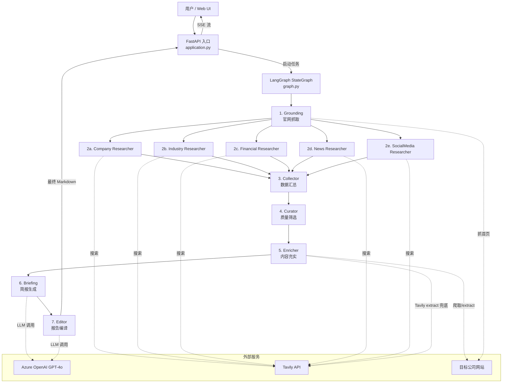

# 系统架构

## 高层架构



## 数据流

```
InputState {company_url, company_name?, industry?, hq_location?}
    ↓
ResearchState {
    site_scrape,           // Grounding 输出
    research_data[],       // 5个 Researcher 输出
    curated_sources[],     // Curator 筛选后
    enriched_sources[],    // Enricher 充实后
    briefings{},           // 5份分类简报
    report_markdown        // 最终报告
}
```

## 关键设计决策

### 1. Fan-out 并行研究

5 个 Researcher 节点完全并行执行（LangGraph `Send` API），每个节点独立搜索不同维度。

### 2. 域名熔断器 (DomainCircuitBreaker)

`scrape_engine.py` 中实现，避免对同一域名路径反复请求失败：
- 按 `domain + 首个有意义路径段` 分组
- 连续 2 次失败后熔断该路径
- 跳过 locale 路径段 (nl/be/en/fr/de 等)

### 3. Prompt 分层

```
seller_profile.py    → 委托方配置（切换客户只改这里）
queries.py           → 搜索查询生成
briefings.py         → 信息提取（不做推理）
editor.py            → 报告编译 + 推广分析（唯一做推理的地方）
```

### 4. SSE 实时推送

后端通过 `asyncio.Queue` 实现事件推送，前端 `EventSource` 接收，支持断线重试。

## 性能数据

| 阶段 | 典型耗时 |
|------|----------|
| Grounding | 3-5s |
| 5x Researchers | 15-25s (并行) |
| Collector | <1s |
| Curator | 3-5s (LLM) |
| Enricher | 30-60s (批量爬取) |
| Briefing | 15-25s (5次 LLM) |
| Editor | 15-20s (2次 LLM: compile + sweep) |
| **总计** | **90-180s** |
